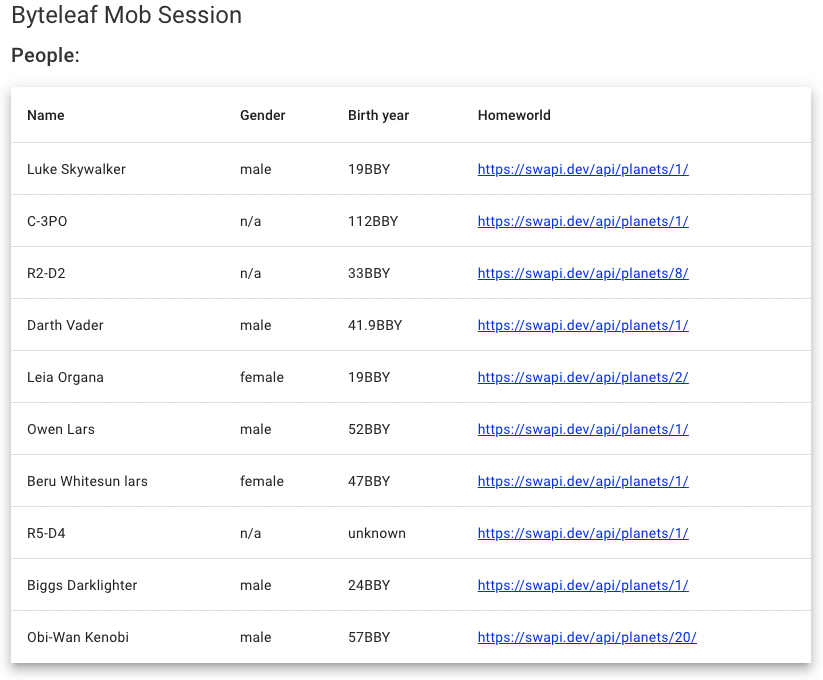

# ByteleafMobSession

This project was generated with [Angular CLI](https://github.com/angular/angular-cli) version 15.2.4.

## TODOs:

1. Fetch data from endpoint: https://swapi.dev/
2. Resolve homeworld value
3. People Detail Page
4. Resolve Films
